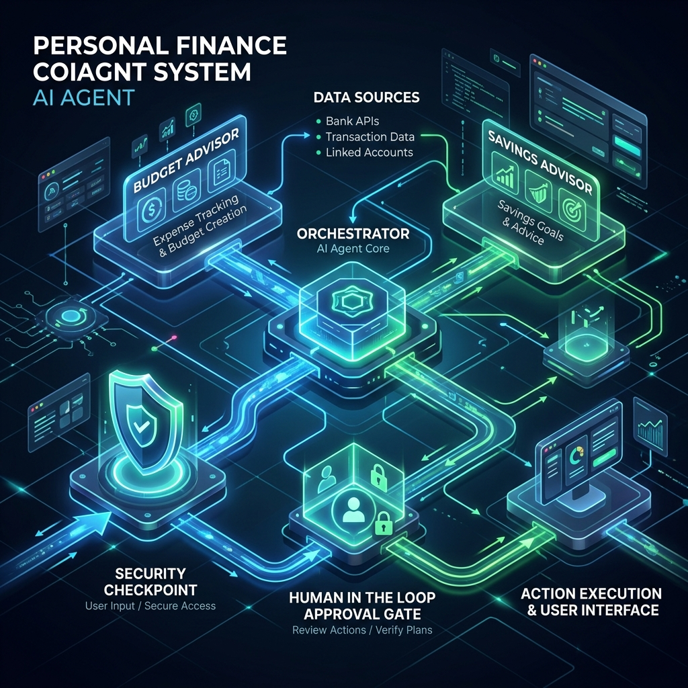

# Personal Finance Coach - Submission Writeup

## Architecture Overview

The Personal Finance Coach uses a multi-agent hierarchical architecture built on the Google Agent Development Kit (ADK). 
The entry point is a fast, graph-based `Workflow` that wraps the agent logic, providing state management, structured execution routing, and ambient UI integration.

### Core Components
1. **Orchestrator Agent:** An `LlmAgent` acting as a router and conversational interface.
2. **Specialized Sub-agents:**
   - `budget_advisor`: Analyzes and plans budgets.
   - `savings_advisor`: Advises on compound interest and savings goals.
3. **Workflow Nodes:** Pre- and post-processing nodes like `security_checkpoint` and `get_human_approval`.

## Advanced ADK Patterns Implemented

### 1. Multi-Agent Delegation
The `orchestrator` uses `AgentTool` to dynamically delegate queries. This ensures that budget math and saving strategies are handled by contextually focused LLMs, reducing hallucination and improving targeted advice.

### 2. Human-in-the-Loop (HITL)
When the `budget_advisor` creates a budget, the orchestrator triggers a HITL process. The workflow detects the budget proposal via a deterministic signal string, pauses execution, and requests user approval via the `RequestInput` ADK event. This ensures that no final budget plan is accepted without the user reviewing and approving the summary.

### 3. Model Context Protocol (MCP) Integration
A FastMCP server (`app/mcp_server.py`) is deployed locally, providing `read_local_data` and `simulate_interest` tools. The `McpToolset` class connects the `budget_advisor` and `savings_advisor` directly to this external data layer, securely bypassing context length limits and providing isolated execution capabilities.

### 4. Enterprise Security Checkpoint
A custom workflow node (`security_checkpoint`) sits in front of the `orchestrator`. It provides:
- **Prompt Injection Detection:** Filters for dangerous phrases like "ignore previous instructions".
- **PII Scrubbing:** Automatically detects and redacts Credit Card numbers and SSNs before they reach the LLM.
- **Audit Logging:** Logs all incoming requests, scrubbed text, and security actions to a local structured JSON log file (`audit.log`).

## Development Experience
The ADK tooling (including `adk web app`) provided an incredibly smooth developer experience for testing complex multi-turn and multi-agent conversations. State inspection and trace visibility made it easy to debug the HITL state flow and MCP tool integrations.
